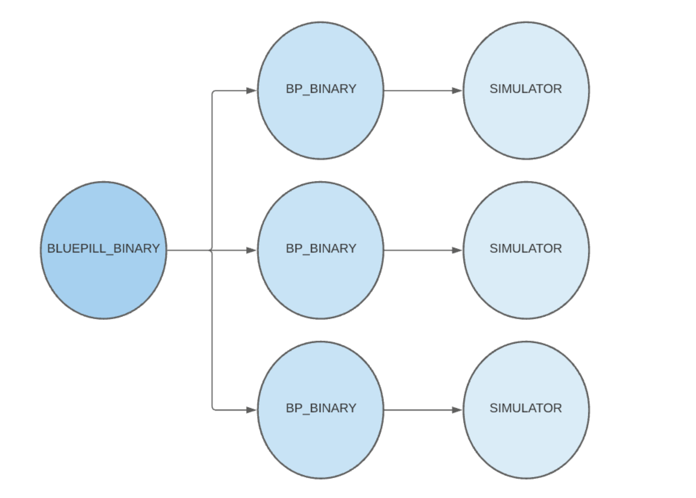
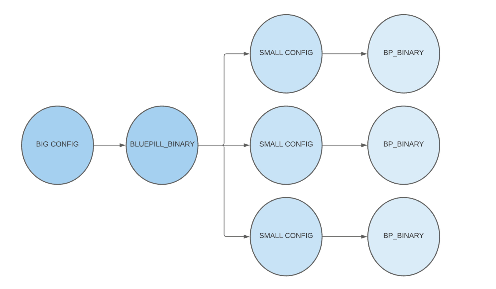
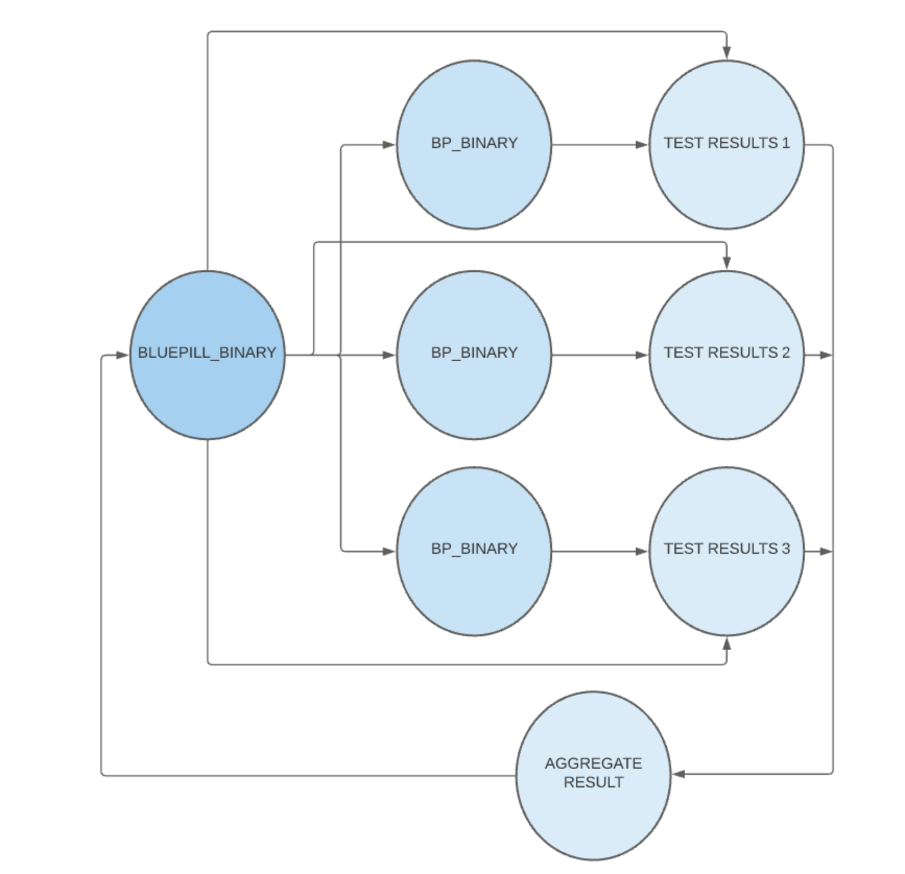
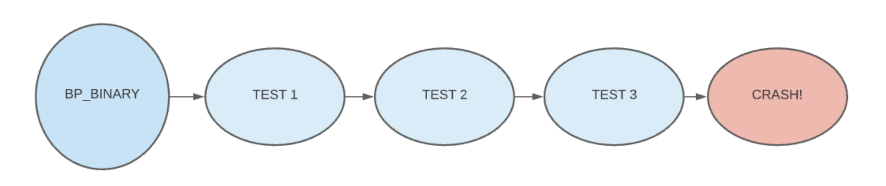

## Bluepill Build
- `bluepill.sh` builds Bluepill in CI (It has a sample app)
	- Technically the script builds Bluepill & the sample app, and runs the tests
- ``BPSampleApp` is the test bed we use for testing Bluepill functionalities. It contains test targets that simulate real world scenarios, e.g a test that crashes, timeouts, UI blockers etc.
	- X86_64 arch is for iOS simulators running on Intel based Macs. arm64 arch is for iOS device and Apple Silicon based Macs.

## Some notes on `Bundles`
- App (builds with) -> (Xcode/Bazel) -> `X.app` (packaged into an IPA, an archive of the app or "Bundle")
- iPhones have ARM processors while Macs have `x86_64` (pre M1 at least)
- Compilation results in an architecture specific binary (or app binary)

## How iOS Simulators work in Mac OS and some tips for verification
- `xcrun simctl boot` will boot the simulator (Alternatively run Simulator.App in /Applications/Xcode.App)
- `ps axuw | grep 'launchd_sim'` -> This is the `launchd` process running inside the Simulator
	- Since the Simulator isn't a VM and shares the same Kernel as the underlying Mac OS, it's possible to inspect the processes running inside the simulator
	- `ps axiw | grep 'CoreSimulator'`
- `xcrun simctl install .... BPSampleApp.app`
- `otool -L MacOS/Simulator`
	- Inspect Frameworks -> /Library/Developer/PrivateFrameworks/CoreSimulator..
	- Bluepill links with PrivateFrameworks (like simctl)
- All functionality is provided as a framework. Simluator UI uses this library and so does Bluepill
- file CoreSimulator
	- Shows you a binary with 2 architectures for M1 compatibility
	- CoreSimulator.framework/Versions/A
		- Poke around to use the framework directly in Bluepill

## iOS Apps Test Classes
- See [XCTest vs XCUITest](https://dzone.com/articles/xcuitest-the-emerging-ios-ui-test-automation-frame#:~:text=XCTest%20%E2%80%93%20Apple's%20official%20framework%20for,and%20components%20at%20any%20level.&text=XCUITest%20%E2%80%93%20A%20UI%20testing%20framework,in%20Swift%20or%20Objective%20C.)

## How we rely on XCTest Framework
```
	<TODO> Print the filetree of a app and test bundle and explain the folder structure
```

`XCTest` is a _Plugin_
```
	bluepill/Build ... /BPSampleApp.app
	tree Base.lproj
	tree Frameworks

	XCTest.Framework
	tree Plugins (Used for writing Plugins which is runtime code for extra functionality)
```

## How Bluepill Executes Tests
`BPSampleTests.xctest` is a Bundle
	- Executable
	- Frameworks
	- CodeSignature
	- Info.plist (`plutil -p Info.plist`)

- `FBundleIdentifier` -> Handle that iOS is using for interaction with the App
- App loads the Plugin (`main -> loadPlugin`)
- App binary dynamically links to `.dylib` files using the dynamic loader
	- Dynamic loader maps a `.dylib` hook to its location in memory (Part of OS funcitonality)
	- `man dyld` (See `DYLD_INSERT_LIBRARIES` option which is what we use in Bluepill)
	- The _trampoline_ code to do this is in `libSystem.B.dylib` (part of the kernel space)
- `otool --help`
	- `otool -L /bin/ls`
	- Gives OS a memory map telling it where to load the libraries in app code
	- <TODO> Move these tips and tricks to a separate doc
- Dynamic Loader can inject libraries *before* app loads its dynamic libraries
	- `DYLD_INSERT_LIBRARIES`
	- So `libXCTestBundleInject.dylib` gets injected before App runs
- Loads `XCTestFramework`, discover tests (Unit Testing) and runs them


## UI Testing
- Xcode generates `<Appname>UITestsRunner.App`
- Load Runner App that runs your application in a Leader/Follower model
- UI Automation is involved here.. and in comes Bluepill

```
tree BPSamepleApp/Plugins
		 ...xctest1
		 ...xctest2
```

## Bluepill High Level Architecture


- `BLUEPILL_BINARY` is a command line application
	- `bluepill/main.m`
	- Starts with the most important task of a Matrix-style opening sequence ;)
	- `BPConfiguration.h` -> App args/settings processor which accepts command line or JSON arguments and differentiates `BP_BINARY` and `BLUEPILL_BINARY` arguments
	- Create `BP_BINARY` processes to run simulators
	- Monitor Simulators for failure
	- Aggregate individual test results into a unified test result
- `BP_BINARY` is designed to run 1 simulator
	- `bp/src/main.m`
- `BLUEPILL_BINARY` doesn't interact with the simulators directly for this very purpose (although this is technically untrue as of today)
- `BLUEPILL_BINARY` eventually needed knowledge of the simulators and we ended up breaking original design.
- One of `bp`'s build targets is a static library called `bplib` (the other target being `BP_BINARY`) which the Bluepill project links into. The original reason for separation was to decouple the Bluepill project from access to `PrivateFramework`.
- Bluepill is fully self contained and needs no external dependencies

## Running Bluepill
- `bluepill --config bp/tests/Resources ... config.json`

- `BPRunner.m`
	- How many `BP_BINARY` processes at a given time?
		- A single `BP_BINARY` instance can't run multiple XCTest Bundles
	- Packing algorithm gets all XCTestBundles in Plugins directory to determine the number of parallel simulators
	- X Tests : Y Simulators (What are some packing strategies?)
	- Perhaps Bluepill can use previous run's stats to determine the packing algorithm and weight by Bundle size if no prior knowledge exists. The key is to parallelize equally.
- Some tests are executed across every `BP_BINARY` instance because the Skip List isn't aware of them.
	- This is because if a test class inherits another class, Objective-C's Polymorphism implementation changes its name in the symbol table thereby making it non-trivial to find at tests discovery time.
	- We've deliberately avoided fixing this issue given the complexity overhead
- `BPTreeParser` monitors the test output to stdout (i.e. the Simulator's console output) to determine the state of the Simulator, essentially whether it hung or not.
	- In general, we rely heavily on the Test output format exposing us to brittleness and Bluepill's test coverage needs improvement
	- TODO: Explore mechanisms that reveal the state of the Simulator and avoid reliance on console output parsing
	- Another factor complicating testing Bluepill is that fact that test outputs contain expected failures and it's hard to extricate them from failures of the Bluepill software (Yes, we're aware of the irony in the difficulty of testing a test execution software)
- Note that if a simulator crashes, `BP_BINARY` will restart the simulator _with prior context_ and *resume* testing whereas if the `BP_BINARY` instance crashes, `BLUEPILL_BINARY` will create another `BP_BINARY` instance and restart all the tests that were originally assigned to the `BP_BINARY` instance that crashed.
- `BLUEPILL_BINARY` creates a simulator, installs the app with the test bundles, shuts down the simulator and gives the `BP_BINARY` instance it creates the simulator's UUID.
	- This way a `BP_BINARY` instance can _clone_ the simulator that was already setup to save time (by avoiding multiple GBs of data copying)
	- However, if the instance crashes, it does have the option of creating a simulator from scratch
- `BLUEPILL_BINARY` aggregates the test results

- `BLUEPILL_BINARY` kepps CPU usage/memory details of all `BP_BINARY` processes
	- Similar to a Chrome Trace/Log


## Summary
- `BLUEPILL_BINARY` is responsible for:
	- Packing algorithm
	- Planning the test run
	- Monitoring CPU/Memory usage
	- Aggregating test results

- `BP_BINARY` is spawned by `BLUEPILL_BINARY`
	- It runs a single simulator and runs one or more test bundles
