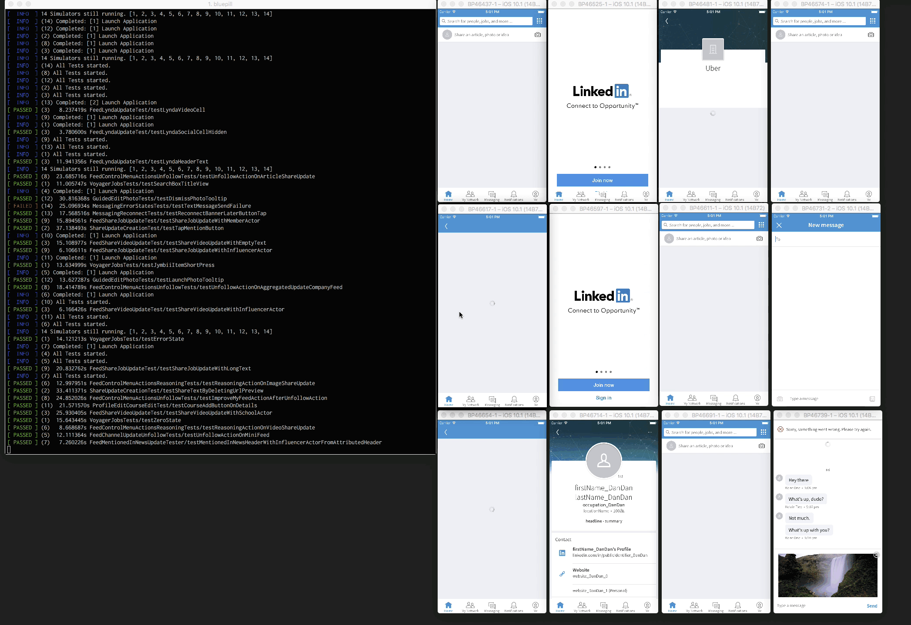

Bluepill is a tool to run iOS tests in parallel using multiple simulators.

## Motivation

[LinkedIn](https://www.linkedin.com) created Bluepill to run its large iOS test suite in a reasonable amount of time. If you want the long story, read [the blog post](https://engineering.linkedin.com/blog/2017/01/open-sourcing-bluepill--run-ios-tests-in-multiple-simulators).

## Features

-  Running tests in parallel by using multiple simulators.
-  Automatically packing tests into groups.
-  Running tests in headless mode to reduce memory consumption.
-  Generating a junit report after each test run.
-  Reporting test running stats, including test running speed and environment robustness.
-  Retrying when the Simulator hangs or crashes.

## Usages

It is quick and easy to start using Bluepill!

- Get bluepill binary: build from source or use our [releases](https://github.com/linkedin/bluepill/releases/). You can also get the binary from Homebrew.

``` shell
$ brew install bluepill
```

- Build your app and test bundle. You must `build-for-testing` if you use `xcodebuild` in terminal.
- Run bluepill using the `.xctestrun` file generated by Xcode.

```shell
$ bluepill --xctestrun-path ./SampleAppTest_iphonesimulator10.3-x86_64.xctestrun -o ./output/
```

Alternatively, you can use a configuration file like the one below:

```
{
   "xctestrun-path": "./SampleAppTest_iphonesimulator10.3-x86_64.xctestrun", # Relative path or abs path
   "output-dir": "./build/" # Relative path or abs path
}
```

And run

```shell
$ bluepill -c config.json
```

## Flags

A full list supported options are listed here.


|   Config Arguments     | Command Line Arguments | Explanation                                                                         | Required | Default value    |
|:----------------------:|:----------------------:|-------------------------------------------------------------------------------------|:--------:|:----------------:|
|          app           |           -a           | The path to the host application to execute (your `.app`)                           |     N    | n/a              |
|     xctestrun-path     |                        | The path to the `.xctestrun` file that xcode leaves when you `build-for-testing`.   |     Y    | n/a              |
|     test-plan-path     |                        | The path of a json file which describes the test plan. It is equivalent to the `.xctestrun` file generated by Xcode, but it can be generated by a different build system, e.g. Bazel |     Y    | n/a              |
|       output-dir       |           -o           | Directory where to put output log files. **(bluepill only)**                        |     Y    | n/a              |
|         config         |           -c           | Read options from the specified configuration file instead of the command line.     |     N    | n/a              |
|         device         |           -d           | On which device to run the app.                                                     |     N    | iPhone 8         |
|         exclude        |           -x           | Exclude a testcase in the set of tests to run  (takes priority over `include`).     |     N    | empty            |
|        headless        |           -H           | Run in headless mode (no GUI).                                                      |     N    | off              |
|        clone-simulator |           -L           | Spawn simulator by clone from simulator template.                                   |     N    | off              |
|        xcode-path      |           -X           | Path to xcode.                                                                      |     N    | xcode-select -p  |
|         include        |           -i           | Include a testcase in the set of tests to run (unless specified in `exclude`).      |     N    | all tests        |
|       list-tests       |           -l           | Only list tests and exit without executing tests.                                   |     N    | false            |
|        num-sims        |           -n           | Number of simulators to run in parallel. **(bluepill only)**                        |     N    | 4                |
|      printf-config     |           -P           | Print a configuration file suitable for passing back using the `-c` option.         |     N    | n/a              |
|      error-retries     |           -R           | Number of times to recover from simulator/app crashing/hanging and continue running.|     N    | 4                |
|    failure-tolerance   |           -f           | Number of times to retry on test failures                                           |     N    | 0                |
|    only-retry-failed   |           -F           | Only retry failed tests instead of all. Also retry test that timed-out/crashed.     |     N    | false            |
|         runtime        |           -r           | What runtime to use.                                                                |     N    | iOS 13.3         |
|      stuck-timeout     |           -S           | Timeout in seconds for a test that seems stuck (no output).                         |     N    | 300s             |
|      test-timeout      |           -T           | Timeout in seconds for a test that is producing output.                             |     N    | 300s             |
|    test-bundle-path    |           -t           | The path to the test bundle to execute (single `.xctest`).                          |     N    | n/a              |
| additional-unit-xctests|           n/a          | Additional XCTest bundles that is not Plugin folder                                 |     N    | n/a              |
|  additional-ui-xctests |           n/a          | Additional XCTUITest bundles that is not Plugin folder                              |     N    | n/a              |
|      repeat-count      |           -C           | Number of times we'll run the entire test suite (used for load testing).            |     N    | 1                |
|        no-split        |           -N           | Test bundles you don't want to be packed into different groups to run in parallel.  |     N    | n/a              |
|         quiet          |           -q           | Turn off all output except fatal errors.                                            |     N    | YES              |
|       diagnostics      |           n/a          | Enable collection of diagnostics in output directory in case of test failures.      |     N    | NO               |
|          help          |           -h           | Help.                                                                               |     N    | n/a              |
|     runner-app-path    |           -u           | The test runner for UI tests.                                                       |     N    | n/a              |
| screenshots-directory  |           n/a          | Directory where simulator screenshots for failed ui tests will be stored.           |     N    | n/a              |
|       video-paths      |           -V           | A list of videos that will be saved in the simulators.                              |     N    | n/a              |
|       image-paths      |           -I           | A list of images that will be saved in the simulators.                              |     N    | n/a              |
| unsafe-skip-xcode-version-check |               | Skip Xcode version check                                                            |     N    | NO               |


## Exit Status

Here is a list of Bluepill exit codes. If a Bluepill execution has multiple exit codes from same or different test bundles, the final exit code is a combination of all exit codes. Note that app crashes are fatal even if the test passes on retry.

```shell
  BPExitStatusAllTestsPassed          = 0,
  BPExitStatusTestsFailed             = 1 << 0,
  BPExitStatusSimulatorCreationFailed = 1 << 1,
  BPExitStatusInstallAppFailed        = 1 << 2,
  BPExitStatusInterrupted             = 1 << 3,
  BPExitStatusSimulatorCrashed        = 1 << 4,
  BPExitStatusLaunchAppFailed         = 1 << 5,
  BPExitStatusTestTimeout             = 1 << 6,
  BPExitStatusAppCrashed              = 1 << 7,
  BPExitStatusSimulatorDeleted        = 1 << 8,
  BPExitStatusUninstallAppFailed      = 1 << 9,
  BPExitStatusSimulatorReuseFailed    = 1 << 10
```
**Note:** Please refer to `bp/src/BPExitStatus.h` for the latest/exact exit codes.


## Demo



## Requirements

Bluepill only works with **Xcode 11.3**. If you're looking for old Xcode support, please check out the other branches:

* [Xcode-8](https://github.com/linkedin/bluepill/tree/xcode8)
* [Xcode-9.0](https://github.com/linkedin/bluepill/tree/xcode-9.0)
* [Xcode-9.1](https://github.com/linkedin/bluepill/tree/xcode-9.1)
* [Xcode-9.2](https://github.com/linkedin/bluepill/tree/xcode-9.2)
* [Xcode-9.3](https://github.com/linkedin/bluepill/tree/xcode-9.3)
* [Xcode-9.4](https://github.com/linkedin/bluepill/tree/xcode-9.4)
* [Xcode-10.0](https://github.com/linkedin/bluepill/tree/xcode-10.0)
* [Xcode-10.1](https://github.com/linkedin/bluepill/tree/xcode-10.1)
* [Xcode-10.2](https://github.com/linkedin/bluepill/tree/xcode-10.2)
* [Xcode-10.3](https://github.com/linkedin/bluepill/tree/xcode-10.3)
* [Xcode-11.0](https://github.com/linkedin/bluepill/tree/xcode-11.0)
* [Xcode-11.1](https://github.com/linkedin/bluepill/tree/xcode-11.1)
* [Xcode-11.2](https://github.com/linkedin/bluepill/tree/xcode-11.2)

**Note:** Refer to `unsafe-skip-xcode-version-check` flag introduced in `Bluepill v5.2.1` relaxing the Xcode version checks. Please make sure it is well tested and the underlying risks are understand.

## Acknowledgement

Bluepill was inspired by [parallel iOS test](https://github.com/plu/parallel_ios_tests) and Facebook’s [xctool](https://github.com/facebook/xctool) and [FBSimulatorControl](https://github.com/facebook/FBSimulatorControl). The Bluepill icon was created by [Maria Iu](https://www.linkedin.com/in/mariaiu/).

## Fastlane Support

If you're using [Fastlane](https://github.com/fastlane/fastlane) to run your tests, you're in luck! You can integrate Bluepill into your project with very little change to your existing setup. Just integrate one of the following Fastlane plugins, and you'll be on your way:

- [Redpill](https://github.com/omniprojects/fastlane-plugin-redpill) - The most up-to-date plugin; it's is maintained by [Omni](https://github.com/omniprojects) and offers a full set of options to hook into Bluepill. As of this writing, Redpill is compiled against Xcode 9.1, and intended for use with [CircleCI](https://circleci.com). It will be updated with newer versions of Xcode when CircleCI supports them.
- [fastlane-plugin-bluepill](https://github.com/tbrand/fastlane-plugin-bluepill) - Last updated Nov. 7th, offers basic support for working with the Bluepill binary.
- [Bluepillar](https://github.com/Shashikant86/fastlane-plugin-bluepillar) - Last updated May 29th, it's the original fastlane plugin for working with Bluepill. It was inspired by [this blog post](https://medium.com/@shashikant.jagtap/running-xcuitests-in-parallel-with-fastlane-and-bluepill-370e8ba90958).
- [XBluepill](https://github.com/kisialiu/fastlane-plugin-xbluepill) - Last updated Jan 27th. It supports all Bluepill options. Thera are some differences from other plugins:
   - Support XCode 9.2
   - No need to build your project before using the plugin. Builds you project by itself and put xctestrun file automatically;
   - Can reset all simulators if needed (removes all current simulators and recreates default from scratch);

## Bitrise.io Support

If you're using [Bitrise.io](https://bitrise.io) as your CI/CD, you can start using Bluepill immediately. Just add the **Bluepill Build/Test for iOS** step to your existing workflow. This [open source step](https://github.com/HealthengineAU/bitrise-step-bluepill-build-test-for-ios) is maintained by [HealthEngineAU](https://github.com/HealthengineAU) and supports Xcode 8.3 and later.

## Q & A
- Are we able to run Xcode UI Testing bundle with Bluepill

  _YES_, we recently added support for Xcode UI Testing bundles. Thanks to the inspiration from [FBSimulatorControl](https://github.com/facebook/FBSimulatorControl). Bluepill now supports Xcode unit test bundle and UI test bundles.

- Easiest way to get Bluepill binary?

  Latest [release](https://github.com/linkedin/bluepill/releases/).

- How to test Bluepill in Xcode?

  Select BPSampleApp scheme and build it first. Then you can switch back to `bluepill` or `bluepill-cli` scheme to run their tests.

- How to get Bluepill binary from source?

  Run `./scripts/bluepill.sh build` to test and build Bluepill. The binary will be output in the ./build folder.

- How to test my changes to Bluepill?

  Run `./scripts/bluepill.sh test`.

- How to BUMP the max files and max procs to support running multiple simulators on macOS?

  Check - https://blog.dekstroza.io/ulimit-shenanigans-on-osx-el-capitan/
